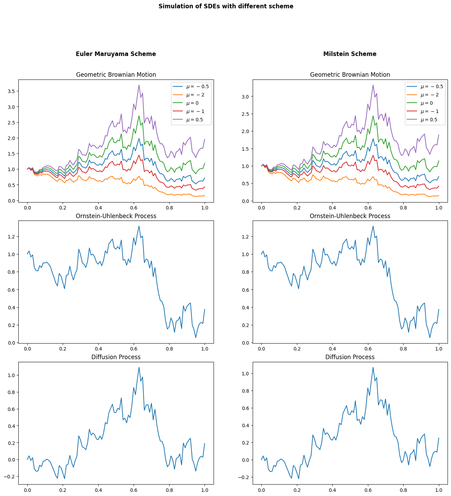
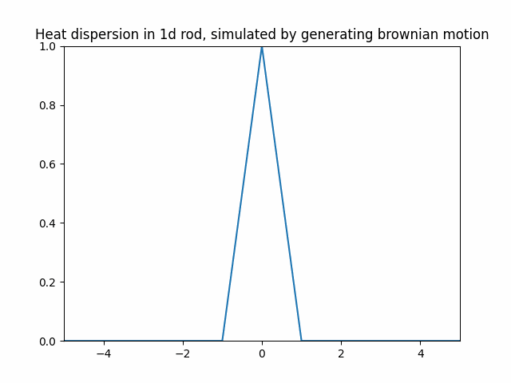

# Stochastic-Calculus
This repo contains numerical studies closely following A First Course in Stochastic Calculus Louis-Pierre Arguin.
The notebook contains code to achieve the following:

## Sampling stochastic processes
Including how to sample stochastic processes following SDE using different levels of accuracy schemes.

# Solving PDE with stochastic processes
Solving the 1-dimension heat equation by sampling Brownian motion

